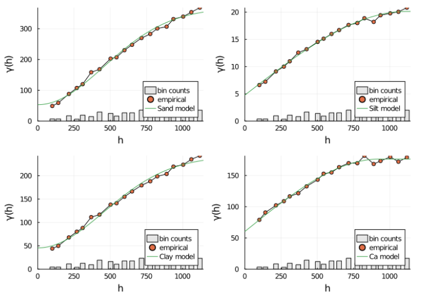

# Deere challenge

In this challenge, we are given a set of measurements with point support,
and are asked to fit a variogram model to the data automatically.

This baseline solution assumes a isotropic model and a single variogram
structure. Students can try improve upon the baseline by contributing
to the [GeoStats.jl](https://github.com/JuliaEarth/GeoStats.jl) framework.



## Installation

Please install Pluto in Julia with:

```julia
] add Pluto
```

## Notebooks

To reproduce the solution, start a Pluto session with:

```julia
import Pluto
Pluto.run()
```

and select the `solution.jl` notebook.
